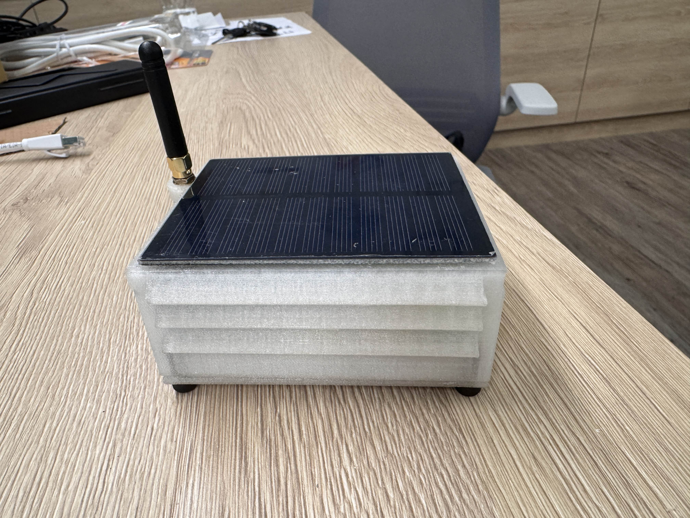
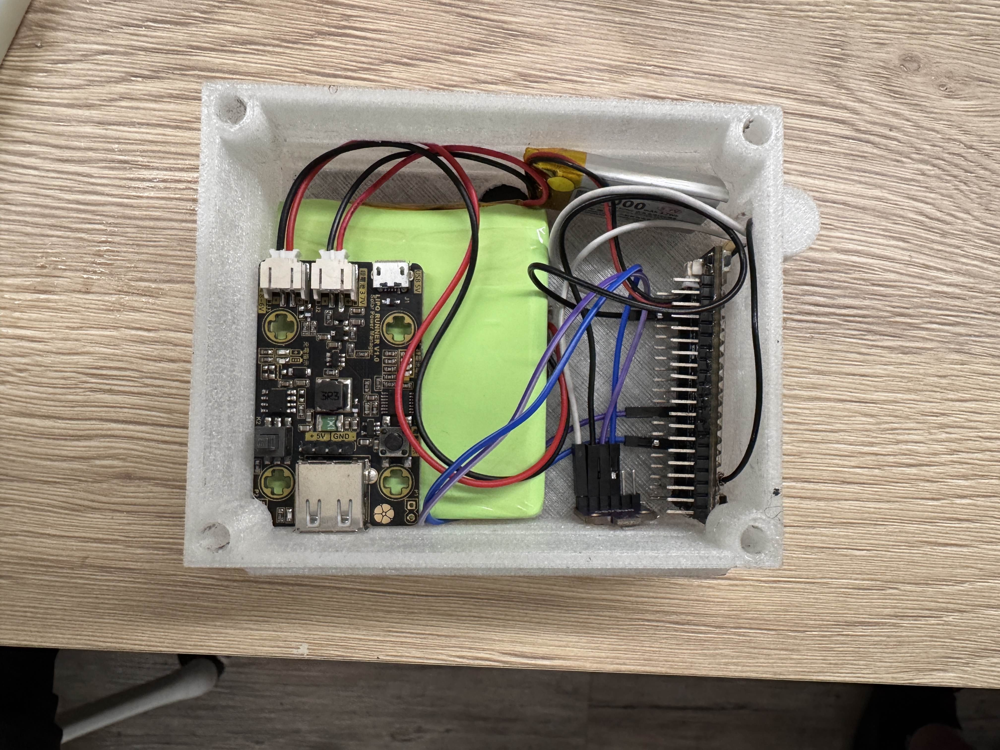
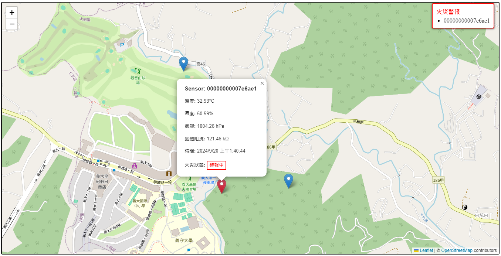
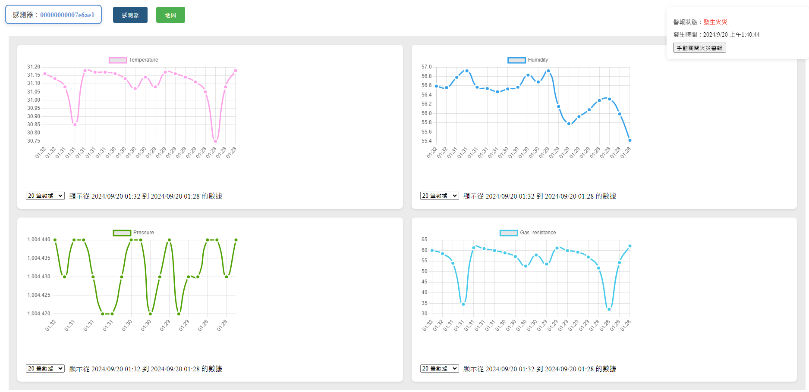

# 智慧森林: 基於 LoRa 的火災監測與數據分析平台

## 說明
智慧森林是一個火災監測與數據分析平台，透過物聯網技術（IoT）來即時監控森林環境中的溫度、濕度、氣壓及揮發性有機物（VOC）等關鍵指標，以預防火災和監控環境變化。  
該平台使用 LoRa 無線通訊技術來實現長距離、低功耗的感測資料傳輸，適合應用於廣大且偏遠的森林地區。  

## 架構
前端: `vue3`  
後端: `Node.js`, `MQTT`, `MariaDB`  
感測器: `Bosch BME680`, `ESP32 heltec wireless stick lite v3`, `LoRaWAN`  

使用 BME680 讀取環境資料，並由 ESP32 上搭載的 LoRa 協定發送至 IoT gateway，再由 IoT gateway 使用 MQTT 發送至後端 server 中。  
前端再藉由 RESTful API 向後端獲取當前所有感測節點資料並顯示於地圖上。

  
  
  
  

