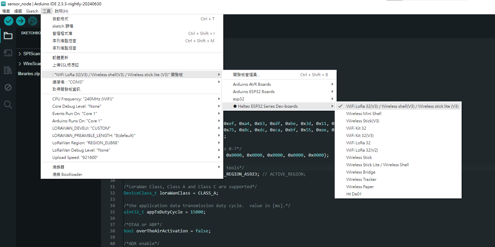
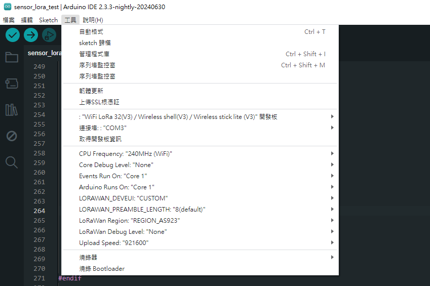

# 感測節點


### 開發板管理網址
```
https://github.com/Heltec-Aaron-Lee/WiFi_Kit_series/releases/download/1.0.0/package_heltec_esp32_index.json
```


### 開發板選擇
安裝 [`Heltec ESP32 Series Dev-boards`](https://github.com/Heltec-Aaron-Lee/WiFi_Kit_series)  
選擇 `WiFi LoRa 32(V3)/Wireless shell(V3)/Wireless stick lite (V3)` 開發板  

  


### 需求函式庫
```
LoRaWan_APP.h
```
> `LoRaWan_APP.h` 在 Arduino IDE 安裝時有內建  
> 可能路徑 **C:\Users\user\AppData\Local\Arduino15\packages\Heltec-esp32\hardware\esp32\1.0.0\libraries\LoraWan102\src\LoRaWan_APP.h**


### 其他設置
`loraWanRegion` 只有在程式碼中設置 **LORAMAC_REGION_AS923** 沒用，還需在 Arduino IDE > 工具 中設置，不然編譯成功後運行只會卡在 spi timeout  

  


`LoRaWan_APP.h` 使用 ABP 模式仍須設置 OTAA 參數，不然會編譯失敗 :)  

